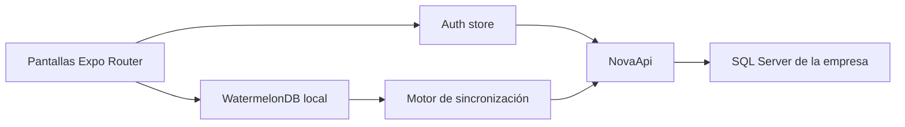

# Arquitectura

## Vista general



La interfaz trabaja contra la base local. La red es una preocupación del motor de sincronización,
no de cada formulario. Esto permite que agregar, editar, eliminar, buscar y consultar funcionen sin
conexión una vez descargados los datos requeridos.

## Estructura de carpetas

```text
src/
  app/                  Rutas y pantallas de Expo Router
  auth/                 Login, restauración y store de sesión
  components/
    crud/               NCrud offline-first
    forms/              NText, NDate, NSelect y estructura de formulario
    ui/                 Primitivas de React Native Reusables
  contracts/
    entities/           Un archivo Zod por entidad
    api.ts              Envelope ResponseApi
    auth.ts             Contratos de sesión
    sync.ts             Contratos de Pull, Push y conflicto
  database/
    models/             Modelos WatermelonDB
    database.native.ts  SQLiteAdapter
    database.web.ts     LokiJSAdapter + IndexedDB
    schema.ts           Tablas y columnas locales
    migrations.ts       Migraciones locales
  features/             Casos de uso organizados por módulo y recurso
    */*/queries.ts      Lecturas y observables WatermelonDB
    */*/service.ts      Comandos, validaciones y reglas de negocio
    */*/types.ts        DTOs de entrada y salida para la UI
  lib/                  API, storage, formato y seguridad
  sync/                 Configuración, motor, conflictos y estado
```

## Enrutamiento

| Ruta | Función |
| --- | --- |
| `/login` | Autenticación en línea |
| `/` | Inicio y estado local resumido |
| `/explore` | Diagnóstico y ejecución de sincronización |
| `/conflicts` | Resolución de conflictos |
| `/definitions` | CRUD local de `GenDefinition` |
| `/definition-details` | CRUD local de `GenDefinitionDetail` |
| `/branches` | CRUD local de `RstBranch` |
| `/tables` | Consulta local de `RstTable` |

`AuthGate` protege todas las rutas. Una sesión almacenada permite abrir la app sin red. Para hacer
Pull o Push se exige una sesión en línea válida y se intenta renovar cuando expiró.

## Autenticación y almacenamiento seguro

Flujo de login:

1. Se obtiene `EXPO_PUBLIC_API_URL`.
2. La contraseña se prepara con `hashPassword` y el pepper configurado.
3. Se ejecuta `POST /Token`.
4. La respuesta se valida con `AuthResponseSchema`.
5. En web, NovaApi administra cookies HTTP.
6. En nativo, se extraen tokens de la respuesta y se guardan en SecureStore.
7. La información no secreta de la sesión se conserva para habilitar el acceso offline.
8. En web se intenta inicializar el token CSRF tras el login, el refresh y la restauración de
   sesión. Un fallo aislado de ese GET no invalida una autenticación ya completada; la primera
   mutación puede reinicializarlo y reintentarse una vez.

Implementación de storage:

- Web: `localStorage` para configuración/sesión; cookies para autenticación HTTP.
- iOS/Android: `expo-secure-store` para configuración y tokens.
- Entidades: WatermelonDB, separado del storage de autenticación.

Cerrar sesión siempre borra la sesión local, incluso si el servidor no responde.

### Renovación de tokens en el cliente

Todos los clientes creados por `createApiClient` comparten dos interceptores de seguridad:

1. **CSRF (web)**: las mutaciones envían `X-CSRF-TOKEN` con el request token en memoria. Si el
   servidor responde 400 por CSRF, se reinicializa el token y se reintenta una vez.
2. **Refresh en 401**: ante un 401 no autenticado se ejecuta un único refresh compartido
   (single-flight). Si el refresh funciona, se reintenta la petición original una vez con el token
   rotado (nativo) o las cookies nuevas (web). Si falla:
   - Falla transitoria (sin respuesta de red, 5xx, 429): se conserva la sesión local
     (offline-first) y la siguiente petición en línea reintenta el refresh.
   - Falla permanente (400/401/403 o token inválido): se revoca la sesión local y la app vuelve al
     login.

Al cerrar o invalidar una sesión también se elimina el token CSRF mantenido en memoria. Durante el
arranque, un refresh rechazado permanentemente elimina el acceso local; solo los fallos transitorios
conservan la sesión para continuar offline.

Los endpoints `/Token*` quedan excluidos de ambos interceptores para evitar recursión.


## Base de datos local

### Adaptadores

- Nativo: SQLiteAdapter con JSI, base `nova-app`.
- Web: LokiJSAdapter persistido en IndexedDB, base `nova-app`.

La IndexedDB de cada perfil de navegador es independiente. Ver datos en Chrome no implica que
estén presentes en otro navegador, ventana aislada o perfil automatizado.

### EntityBase local

Todas las tablas comparten:

| Campo | Uso |
| --- | --- |
| `SyncId` | UUID estable global |
| `SyncVersion` | Versión Base64 del servidor |
| `SecStatus` | Estado lógico |
| `CreateUserId` | Usuario creador |
| `UpdateUserId` | Último usuario modificador |
| `DeleteUserId` | Usuario eliminador |
| `CreateDate` | Fecha ISO de creación |
| `UpdateDate` | Fecha ISO de modificación |
| `DeleteDate` | Fecha ISO de eliminación |

WatermelonDB agrega sus metadatos internos:

- `id`: en Nova App debe ser el mismo UUID de `SyncId`.
- `_status`: `synced`, `created`, `updated` o `deleted`.
- `_changed`: columnas modificadas localmente.

### Cambios de esquema

La versión actual es `1`. Para cambiar columnas:

1. Agregar una migración en `src/database/migrations.ts`.
2. Incrementar `version` en `src/database/schema.ts`.
3. Actualizar modelo y contrato.
4. Probar actualización de una base existente, no solo instalación limpia.

No incrementar la versión sin migración. No usar `unsafeResetDatabase` como sustituto de una
migración publicada.

## Contratos

Cada entidad vive en su propio archivo bajo `src/contracts/entities`. Zod se usa para impedir que
una respuesta incompleta o con tipos incorrectos contamine la base local.

Los nombres se mantienen iguales a las clases y tablas del backend. Ejemplo correcto:

```text
GenDefinition
GenDefinitionDetail
```

Ejemplos incorrectos:

```text
gen_definition_details
GenDefinitionDetails
```

## Cliente HTTP

`src/lib/api.ts` exporta una única instancia Axios llamada `api`. Lee `EXPO_PUBLIC_API_URL` una vez,
al cargar el módulo, y centraliza cookies web, bearer token nativo, CSRF, timeout y refresh token.
Los servicios deben limitarse a importar `api` y ejecutar `api.get`, `api.post`, etc.; no deben leer
`BaseUrl`, recuperar tokens ni crear instancias Axios.

`SyncConnection.BaseUrl` permanece en `src/sync/config.ts` únicamente como parte de la identidad del
alcance local y para detectar cambios de instalación. No usarlo para construir clientes por servicio.

## Componentes reutilizables

`NC​​rud` presenta registros WatermelonDB y su estado local. En escritorio usa tabla horizontal;
en pantallas compactas usa filas verticales. Proporciona búsqueda, paginación, selección y comandos
de alta/edición/eliminación.

La presentación sigue la densidad operativa de Nova Web y usa la misma familia Poppins 400/600/700:
encabezados y acciones compactos, filas de escritorio de altura fija, tipografía pequeña y columnas
flexibles que ocupan todo el ancho del CRUD.
No asignar a la tabla un ancho fijo menor que su contenedor. En móvil se conserva el formato vertical,
el toolbar reemplaza los iconos por el selector `ACCIONES` y el ordenamiento usa una franja
`ORDENAR POR`. Cada tarjeta agrega `SINCRONIZACIÓN` como dato propio de la aplicación offline,
además de las columnas configuradas por el recurso.

El tema claro/oscuro se controla con `ThemeToggle` y se persiste mediante `src/theme/theme.ts`. Las
pantallas y los componentes compartidos deben usar los tokens de `global.css` (`background`, `card`,
`foreground`, `border`, etc.) en vez de colores de superficie fijos, para heredar ambos temas.
Estos tokens reflejan la paleta neutral de Nova Web. El valor predeterminado es Nova (`#002aff`),
pero `SecUserPreference.PrimaryColor` lo reemplaza por usuario; `primary-selection` representa el
primario vigente con 15 % de opacidad. Los iconos deben declarar un token
de texto (`text-foreground`, `text-muted-foreground`, etc.) y nunca depender del negro predeterminado
de la librería en modo oscuro.

La identidad visual no debe teñir toda la interfaz. Fondos, tarjetas, campos, bordes y tipografía
usan la escala neutral de Nova Web; `PrimaryColor` se reserva para foco, selección, acciones
principales e indicadores. El login es independiente de la preferencia autenticada: tarjeta
`neutral-100/80`, campos blancos translúcidos, textos neutral-800/500 y botón neutral-900. Esto
evita mostrar el tema o color privado del usuario anterior antes de autenticar.

El login reutiliza los mismos assets responsive que Nova Web: `logo-nova_b.svg` a 32 px desde el
breakpoint de escritorio y `logo-nova.svg` a 40 px en móvil. El fondo `bg-nova.webp` es el mismo
archivo en ambos proyectos. En web se conserva el desenfoque de 2 px del fondo y el desenfoque 2xl
de la tarjeta; la estructura mide 440 px de ancho, con campos de 48 px y radio exterior de 40 px.

La pantalla `appearance` administra `Theme`, `PrimaryColor` y `HeaderColor`. Mantiene una vista
previa separada de la última preferencia confirmada: salir sin guardar restaura los colores previos.
Al guardar, conserva primero una
copia local para poder aplicar la apariencia offline y usa los mismos endpoints
`SecUserPreference/MyPreferences` y `SecUserPreference/Save` de Nova Web. Al autenticar, la preferencia
del servidor se aplica sobre el fallback local. Si Save no puede llegar al servidor, guarda una cola
única en `nova.appearance.pending`; se reintenta antes de descargar preferencias al autenticar.

### Contrato NCrud local

El contrato replica el vocabulario de Nova Web: `Page`, `PageSize`, `SearchText`, `OrderBy`,
`SortOrder` y `Filter`. Su ejecución es local:

```text
Pantalla -> NCrud -> useNCrudController -> NCrudDataSource -> WatermelonDB
```

`createLocalCrudDataSource` traduce el contrato a `Q.where`, `Q.like`, `Q.sortBy`, `Q.skip` y
`Q.take`. Obtiene el total con `observeCount` y mantiene la página reactiva con
`observeWithColumns`. No cargar una tabla completa para luego ejecutar `filter/sort/slice` en
memoria.

Cada datasource debe declarar explícitamente:

- columnas buscables;
- mapa permitido de columnas ordenables;
- columnas observadas;
- orden predeterminado;
- filtros tipados;
- proyección del modelo al DTO.

La lista blanca de ordenamiento evita aceptar nombres arbitrarios. `GenDefinition` es el primer
recurso migrado al datasource paginado; el modo `rows` de `NCrud` se conserva temporalmente durante
la migración de las demás pantallas.

Los formularios actuales reutilizan:

- `NText`: texto, mayúsculas y números.
- `NDate`: fecha con implementación web/nativa.
- `NSelect`: opciones tipadas y búsqueda.
- `FormField`/`NField`: estructura de etiqueta, ayuda y error.

La UI no llama a endpoints Save ni accede directamente a WatermelonDB. Cada recurso expone:

- `queries.ts`: consultas locales, filtros, ordenamiento, proyección a DTO y observación reactiva;
- `service.ts`: altas, ediciones, eliminaciones y reglas de negocio dentro de `database.write`;
- `types.ts`: contratos internos que impiden entregar modelos WatermelonDB a la pantalla.

Las pantallas se limitan a estado visual, navegación, confirmaciones y consumo de estos métodos. La
sincronización se ejecuta por separado. `GenDefinition` bajo `src/features/general/definitions` es
la implementación de referencia para migrar los demás recursos.

`SecStatus` pertenece a la eliminación lógica y se filtra en `queries.ts`. Estados funcionales como
`DefStated` o `DedStated` son reglas distintas: cambiar uno de ellos no debe modificar `SecStatus`.

## Alcance por instalación y sucursal

Una instalación de Nova pertenece a una empresa. Por ello no existe `CompanyId` como selector
global obligatorio en Nova App.

`SyncConnection` admite `BranchId` opcional para restaurante. Actualmente no hay selector de
sucursal. Cuando no existe `BranchId`, los recursos generales se descargan y los recursos estrictos
de sucursal pueden quedar vacíos según las reglas del backend.

Cuando se implemente selección de sucursal, cambiar el alcance provoca un
`unsafeResetDatabase()`. Esto evita mezclar datos locales de dos alcances. Debe diseñarse además qué
hacer si existen cambios pendientes antes de permitir el cambio.
