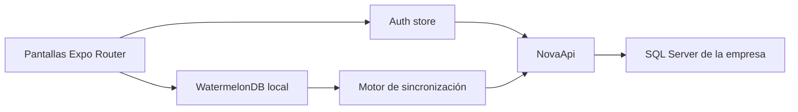

# Arquitectura

## Vista general



La interfaz trabaja contra la base local. La red es una preocupación del motor de sincronización,
no de cada formulario. Esto permite que agregar, editar, eliminar, buscar y consultar funcionen sin
conexión una vez descargados los datos requeridos.

## Estructura de carpetas

```text
src/
  app/                  Rutas y pantallas de Expo Router
  auth/                 Login, restauración y store de sesión
  components/
    crud/               NCrud offline-first
    forms/              NText, NDate, NSelect y estructura de formulario
    ui/                 Primitivas de React Native Reusables
  contracts/
    entities/           Un archivo Zod por entidad
    api.ts              Envelope ResponseApi
    auth.ts             Contratos de sesión
    sync.ts             Contratos de Pull, Push y conflicto
  database/
    models/             Modelos WatermelonDB
    database.native.ts  SQLiteAdapter
    database.web.ts     LokiJSAdapter + IndexedDB
    schema.ts           Tablas y columnas locales
    migrations.ts       Migraciones locales
  lib/                  API, storage, formato y seguridad
  sync/                 Configuración, motor, conflictos y estado
```

## Enrutamiento

| Ruta | Función |
| --- | --- |
| `/login` | Autenticación en línea |
| `/` | Inicio y estado local resumido |
| `/explore` | Diagnóstico y ejecución de sincronización |
| `/conflicts` | Resolución de conflictos |
| `/definitions` | CRUD local de `GenDefinition` |
| `/definition-details` | CRUD local de `GenDefinitionDetail` |
| `/branches` | CRUD local de `RstBranch` |
| `/tables` | Consulta local de `RstTable` |

`AuthGate` protege todas las rutas. Una sesión almacenada permite abrir la app sin red. Para hacer
Pull o Push se exige una sesión en línea válida y se intenta renovar cuando expiró.

## Autenticación y almacenamiento seguro

Flujo de login:

1. Se obtiene `EXPO_PUBLIC_API_URL`.
2. La contraseña se prepara con `hashPassword` y el pepper configurado.
3. Se ejecuta `POST /Token`.
4. La respuesta se valida con `AuthResponseSchema`.
5. En web, NovaApi administra cookies HTTP.
6. En nativo, se extraen tokens de la respuesta y se guardan en SecureStore.
7. La información no secreta de la sesión se conserva para habilitar el acceso offline.

Implementación de storage:

- Web: `localStorage` para configuración/sesión; cookies para autenticación HTTP.
- iOS/Android: `expo-secure-store` para configuración y tokens.
- Entidades: WatermelonDB, separado del storage de autenticación.

Cerrar sesión siempre borra la sesión local, incluso si el servidor no responde.

## Base de datos local

### Adaptadores

- Nativo: SQLiteAdapter con JSI, base `nova-app`.
- Web: LokiJSAdapter persistido en IndexedDB, base `nova-app`.

La IndexedDB de cada perfil de navegador es independiente. Ver datos en Chrome no implica que
estén presentes en otro navegador, ventana aislada o perfil automatizado.

### EntityBase local

Todas las tablas comparten:

| Campo | Uso |
| --- | --- |
| `SyncId` | UUID estable global |
| `SyncVersion` | Versión Base64 del servidor |
| `SecStatus` | Estado lógico |
| `CreateUserId` | Usuario creador |
| `UpdateUserId` | Último usuario modificador |
| `DeleteUserId` | Usuario eliminador |
| `CreateDate` | Fecha ISO de creación |
| `UpdateDate` | Fecha ISO de modificación |
| `DeleteDate` | Fecha ISO de eliminación |

WatermelonDB agrega sus metadatos internos:

- `id`: en Nova App debe ser el mismo UUID de `SyncId`.
- `_status`: `synced`, `created`, `updated` o `deleted`.
- `_changed`: columnas modificadas localmente.

### Cambios de esquema

La versión actual es `1`. Para cambiar columnas:

1. Agregar una migración en `src/database/migrations.ts`.
2. Incrementar `version` en `src/database/schema.ts`.
3. Actualizar modelo y contrato.
4. Probar actualización de una base existente, no solo instalación limpia.

No incrementar la versión sin migración. No usar `unsafeResetDatabase` como sustituto de una
migración publicada.

## Contratos

Cada entidad vive en su propio archivo bajo `src/contracts/entities`. Zod se usa para impedir que
una respuesta incompleta o con tipos incorrectos contamine la base local.

Los nombres se mantienen iguales a las clases y tablas del backend. Ejemplo correcto:

```text
GenDefinition
GenDefinitionDetail
```

Ejemplos incorrectos:

```text
gen_definition_details
GenDefinitionDetails
```

## Componentes reutilizables

`NC​​rud` presenta registros WatermelonDB y su estado local. En escritorio usa tabla horizontal;
en pantallas compactas usa filas verticales. Proporciona búsqueda, paginación, selección y comandos
de alta/edición/eliminación.

Los formularios actuales reutilizan:

- `NText`: texto, mayúsculas y números.
- `NDate`: fecha con implementación web/nativa.
- `NSelect`: opciones tipadas y búsqueda.
- `FormField`/`NField`: estructura de etiqueta, ayuda y error.

La UI no llama a endpoints Save. Las pantallas observan consultas WatermelonDB y escriben dentro de
`database.write`; la sincronización se ejecuta por separado.

## Alcance por instalación y sucursal

Una instalación de Nova pertenece a una empresa. Por ello no existe `CompanyId` como selector
global obligatorio en Nova App.

`SyncConnection` admite `BranchId` opcional para restaurante. Actualmente no hay selector de
sucursal. Cuando no existe `BranchId`, los recursos generales se descargan y los recursos estrictos
de sucursal pueden quedar vacíos según las reglas del backend.

Cuando se implemente selección de sucursal, cambiar el alcance provoca un
`unsafeResetDatabase()`. Esto evita mezclar datos locales de dos alcances. Debe diseñarse además qué
hacer si existen cambios pendientes antes de permitir el cambio.
